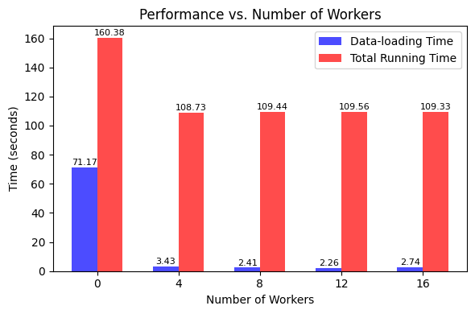

# PyTorch Dataloader, Workload Profiling and Optimization

This project provides hands-on experience with PyTorch Dataloader, profiling machine learning training workloads and optimizing system performance. The main focus is on using a Convolutional Neural Network (CNN) in PyTorch to classify images from the CIFAR10 dataset, specifically using the ResNet-18 model.

## Introduction

PyTorch DataLoader is a utility that helps efficiently load and preprocess data for training and inference in PyTorch. It allows large datasets to be managed, transformations such as normalization and augmentation to be applied, and data to be fed to the model in mini-batches. DataLoader is essential for ensuring that the model trains on diverse and representative data, improving its generalization and performance.

Profiling involves the measurement and analysis of the performance of our machine learning code to identify bottlenecks and areas for improvement. Profiling helps us understand how different parts of our code contribute to overall performance, guiding us in optimizing critical sections for better efficiency.

Optimization in the context of machine learning refers to the improvement of the performance of our models and training pipelines. This includes the optimization of hyperparameters, the selection of suitable optimization algorithms, and the implementation of techniques to enhance training speed and model accuracy. Optimization is crucial for achieving state-of-the-art results and making our models more efficient and effective.

In this project, we will explore the fundamental concepts of PyTorch's DataLoader, profiling, and optimization techniques in the context of machine learning workloads. It aims to give experience in profiling machine learning training and/or inference workloads, critical for understanding and improving system performance. The task involves working with a CNN in PyTorch to classify images from the CIFAR10 dataset, which contains 50,000 32×32 color images. The reference code is available at [pytorch-cifar](https://github.com/kuangliu/pytorch-cifar), and the ResNet-18 model described in "Deep Residual Learning for Image Recognition" is used.

## Setup

**Model:** Create a ResNet-18 model following the specifications in the original paper. Define the layers instead of importing the model directly from PyTorch.

**DataLoader:** Implement a PyTorch program with a DataLoader to load images and labels from the CIFAR10 dataset. Use the following sequence of transformations:
1. Random cropping with size 32×32 and padding 4
2. Random horizontal flipping with a probability of 0.5
3. Normalize each image's RGB channels with mean(0.4914, 0.4822, 0.4465) and variance(0.2023, 0.1994, 0.2010)

## Tasks

1. **Training in PyTorch:** Create a main function to train the model for 5 epochs and calculate per-batch training loss, value, and top-1 training accuracy.

2. **Time Measurement:** Report the running time for data loading, training, and total running time for each epoch.

3. **I/O Optimization:** Measure the total time spent for the DataLoader varying the number of workers to find the best runtime performance.

4. **Profiling:** Compare data-loading and computing time for runs using different numbers of workers and explain any differences.

5. **Training in GPUs vs CPUs:** Report the average running time over 5 epochs using GPU vs CPU.

6. **Experimenting with Different Optimizers:** Run 5 epochs with different optimizers (SGD, SGD with Nesterov, Adagrad, Adadelta, and Adam) and report performance metrics.

7. **Experimenting without Batch Norm:** Report the average training loss and top-1 training accuracy for 5 epochs without batch normalization.

## Running Instructions

To run the code, execute the submit shell scripts (C1_submit.sh to C7_submit.sh) in the High-Performance Computing (HPC) environment. Ensure that the PyTorch dependencies are installed (setting up GPU jobs, SLURM, conda, etc.).

## Summary of Results

#### Data Loading and Training Times

- Significant improvement in data-loading time with increasing number of workers, peaking at 4 workers.
- Training time remains relatively stable across different worker configurations.

#### Optimizer Performance

- Adadelta optimizer showed the best overall performance in terms of training time and accuracy.
- Nesterov and SGD optimizers also demonstrated good performance, while Adam and Adagrad were less effective in this context.

#### Batch Normalization Impact

- Models trained with batch normalization consistently outperformed those without, indicating its importance in stabilizing and accelerating the learning process.

#### GPU vs. CPU Performance

- Training on GPU was significantly faster than on CPU, highlighting the importance of utilizing GPU resources for deep learning tasks.

## Observations

- The optimal number of workers for data loading is 4, as it provides the best balance between efficiency and resource utilization.
- Adadelta emerges as a superior optimizer for this specific training task, indicating the importance of choosing the right optimizer for different scenarios.
- Batch normalization plays a crucial role in enhancing model training, leading to better overall performance.
- The GPU's superior performance underscores its necessity for efficient deep learning model training.

## Inferences

- Parallelizing data loading with multiple workers can significantly improve training efficiency.
- The choice of optimizer can have a substantial impact on model training performance and outcomes.
- Incorporating batch normalization into the model architecture can lead to more stable and faster training.
- Utilizing GPU resources is essential for achieving high-performance in deep learning tasks.

Thanks for exploring this repository!
